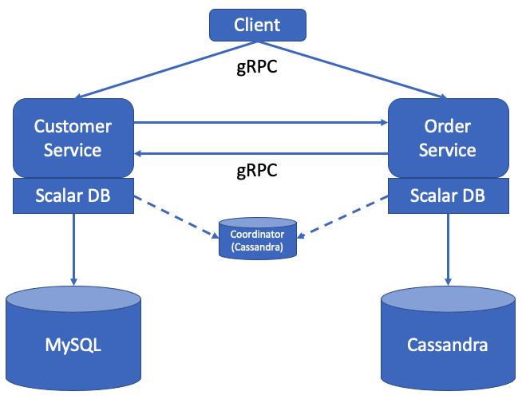
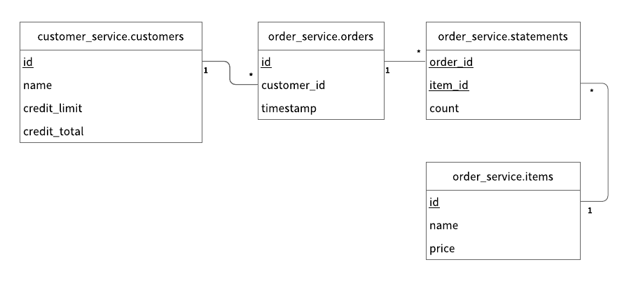
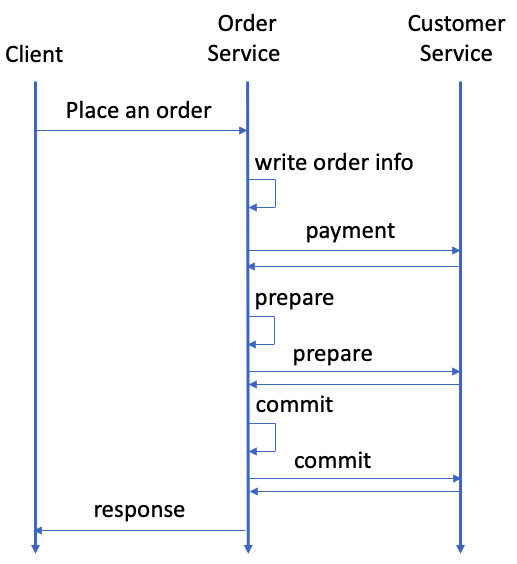

# Microservice Transaction Sample

This tutorial describes how to create a sample application for Microservice Transaction that uses Two-phase Commit Transactions in ScalarDB.
You can find more information about Two-phase Commit Transactions in ScalarDB [here](https://github.com/scalar-labs/scalardb/tree/master/docs/two-phase-commit-transactions.md).

## Prerequisites

- Java (OpenJDK 8 or higher)
- Gradle
- Docker, Docker Compose

## Sample application

### Overview

This tutorial describes how to create a sample application for Microservice Transaction for the same use case as [ScalarDB Sample](https://github.com/scalar-labs/scalardb-samples/tree/main/scalardb-sample) but by using Two-phase Commit Transactions in ScalarDB.

There are two microservices called *Customer Service* and *Order Service* based on the [*Database-per-service* pattern](https://microservices.io/patterns/data/database-per-service.html) in this sample application.

Customer Service manages customers' information including credit card information like a credit limit and a credit total.
Order Service is responsible for order operations like placing an order and getting order histories.
Each service has gRPC endpoints. Clients call the endpoints, and the services call the endpoints each other as well.
Customer Service and Order Service uses MySQL and Cassandra through ScalarDB, respectively.



Note that both services access a small coordinator database used for the Consensus Commit protocol.
The database is service-independent and exists for managing transaction metadata for Consensus Commit in a highly available manner, so we don't think it is violating the database-per-service pattern. 
*NOTE: We also plan to create a microservice container for the coordinator database to truly achieve the database-per-service pattern.*

In this sample application, for ease of setup and explanation, we co-locate the coordinator database in the same Cassandra instance of the Order Service, but of course, the coordinator database can be managed as a separate database.

Also, note that application-specific error handling, authentication processing, etc., are omitted in the sample application since it focuses on explaining how to use ScalarDB.
Please see [this document](https://github.com/scalar-labs/scalardb/blob/master/docs/api-guide.md#handle-exceptions) for the details of how to handle exceptions in ScalarDB.

Additionally, you assume each service has one container in this sample application to avoid considering request routing between the services.
However, for production, because each service typically has multiple servers (or hosts) for scalability and availability, you should consider request routing between the services in Two-phase Commit Transactions.
Please see [this document](https://github.com/scalar-labs/scalardb/blob/master/docs/two-phase-commit-transactions.md#request-routing-in-two-phase-commit-transactions) for the details of Request Routing in Two-phase Commit Transactions.

### Schema

[The schema for Customer Service](customer-service-schema.json) is as follows:

```json
{
  "customer_service.customers": {
    "transaction": true,
    "partition-key": [
      "customer_id"
    ],
    "columns": {
      "customer_id": "INT",
      "name": "TEXT",
      "credit_limit": "INT",
      "credit_total": "INT"
    }
  }
}
```

All the tables for Customer Service are created in the `customer_service` namespace.

- `customer_service.customers`: a table that manages customers' information
    - `credit_limit`: the maximum amount of money a lender will allow each customer to spend when using a credit card
    - `credit_total`: the amount of money that each customer has already spent by using the credit card

[The schema for Order Service](order-service-schema.json) is as follows:

```json
{
  "order_service.orders": {
    "transaction": true,
    "partition-key": [
      "customer_id"
    ],
    "clustering-key": [
      "timestamp"
    ],
    "secondary-index": [
      "order_id"
    ],
    "columns": {
      "order_id": "TEXT",
      "customer_id": "INT",
      "timestamp": "BIGINT"
    }
  },
  "order_service.statements": {
    "transaction": true,
    "partition-key": [
      "order_id"
    ],
    "clustering-key": [
      "item_id"
    ],
    "columns": {
      "order_id": "TEXT",
      "item_id": "INT",
      "count": "INT"
    }
  },
  "order_service.items": {
    "transaction": true,
    "partition-key": [
      "item_id"
    ],
    "columns": {
      "item_id": "INT",
      "name": "TEXT",
      "price": "INT"
    }
  }
}
```

All the tables for Order Service are created in the `order_service` namespace.

- `order_service.orders`: a table that manages order information
- `order_service.statements`: a table that manages order statement information
- `order_service.items`: a table that manages information of items to be ordered

The Entity Relationship Diagram for the schema is as follows:



### Transactions

The following five transactions are implemented in this sample application:

1. Getting customer information. It is a transaction in Customer Service
2. Placing an order (checks if the cost of the order is below the credit limit, then records order history and updates the `credit_total` if the check passes). It is a transaction that spans Order Service and Customer Service.
3. Getting order information by order ID. It is a transaction in Order Service
4. Getting order information by customer ID. It is a transaction in Order Service
5. Repayment (reduces the amount in the `credit_total`). It is a transaction in Customer Service.

### Service Endpoints

The endpoints defined in the services are as follows: 

Customer Service:

- getCustomerInfo
- payment
- prepare
- validate
- commit
- rollback
- repayment

Order Service:

- placeOrder
- getOrder
- getOrders

The `getCustomerInfo` endpoint of Customer Service is for transaction #1 (Getting customer information).

And the `placeOrder` endpoint of Order Service and the `payment`, `prepare`, `validate`, `commit`, and `rollback` endpoints of Customer Service are for transaction #2 (Placing an order) that spans Order Service and Customer Service.
Order Service starts the transaction with the `placeOrder` endpoint, which calls the `payment`, `prepare`, `validate`, `commit`, and `rollback` endpoints of Customer Service.

The `getOrder` of Order Service is for transaction #3, and The `getOrders` of Order Service is for transaction #4.

And the `repayment` endpoint of Customer Service is for transaction #5.

## Setup

### Start Cassandra and MySQL

To start Cassandra and MySQL, you need to run the following `docker-compose` command:

```shell
$ docker-compose up -d cassandra mysql
```

Please note that you need to wait around more than one minute for the containers to be fully started.

### Load schema

You then need to apply the schema with the following commands.
To download the schema loader tool, `scalardb-schema-loader-<VERSION>.jar`, see the [Releases](https://github.com/scalar-labs/scalardb/releases) of ScalarDB and download the version that you want to use.

For MySQL:

```shell
$ java -jar scalardb-schema-loader-<VERSION>.jar --config database-mysql.properties --schema-file customer-service-schema.json
```

For Cassandra:

```shell
$ java -jar scalardb-schema-loader-<VERSION>.jar --config database-cassandra.properties --schema-file order-service-schema.json --coordinator
```

### Start Microservices

First, you need to build the docker images of the sample application with the following command:

```shell
$ ./gradlew docker
```

Then, you can start the microservices with the following `docker-compose` command:

```shell
$ docker-compose up -d customer-service order-service
```

### Initial data

When the microservices start, the initial data is loaded automatically.

After the initial data has loaded, the following records should be stored in the tables:

- For the `customer_service.customers` table:

| customer_id | name          | credit_limit | credit_total |
|-------------|---------------|--------------|--------------|
| 1           | Yamada Taro   | 10000        | 0            |
| 2           | Yamada Hanako | 10000        | 0            |
| 3           | Suzuki Ichiro | 10000        | 0            |

- For the `order_service.items` table:

| item_id | name   | price |
|---------|--------|-------|
| 1       | Apple  | 1000  |
| 2       | Orange | 2000  |
| 3       | Grape  | 2500  |
| 4       | Mango  | 5000  |
| 5       | Melon  | 3000  |

## Run the sample application

Let's start with getting information about the customer whose ID is `1`:

```shell
$ ./gradlew :client:run --args="GetCustomerInfo 1"
...
{"id": 1,"name": "Yamada Taro","credit_limit": 10000}
...
```

At this time, `credit_total` isn't shown, which means the current value of `credit_total` is `0`.

Then, place an order for three apples and two oranges by using customer ID `1`.
Note that the order format is `<Item ID>:<Count>,<Item ID>:<Count>,...`:

```shell
$ ./gradlew :client:run --args="PlaceOrder 1 1:3,2:2"
...
{"order_id": "4ccdb21c-ac03-4b48-bcb7-cad57eac1e79"}
...
```

You can see that running this command shows the order ID.

Let's check the details of the order by using the order ID:

```shell
$ ./gradlew :client:run --args="GetOrder 4ccdb21c-ac03-4b48-bcb7-cad57eac1e79"
...
{"order": {"order_id": "4ccdb21c-ac03-4b48-bcb7-cad57eac1e79","timestamp": 1631605253126,"customer_id": 1,"customer_name": "Yamada Taro","statement": [{"item_id": 1,"item_name": "Apple","price": 1000,"count": 3,"total": 3000},{"item_id": 2,"item_name": "Orange","price": 2000,"count": 2,"total": 4000}],"total": 7000}}
...
```

Then, let's place another order and get the order history of customer ID `1`:

```shell
$ ./gradlew :client:run --args="PlaceOrder 1 5:1"
...
{"order_id": "0b10db66-faa6-4323-8a7a-474e8534a7ee"}
...
$ ./gradlew :client:run --args="GetOrders 1"
...
{"order": [{"order_id": "0b10db66-faa6-4323-8a7a-474e8534a7ee","timestamp": 1631605501485,"customer_id": 1,"customer_name": "Yamada Taro","statement": [{"item_id": 5,"item_name": "Melon","price": 3000,"count": 1,"total": 3000}],"total": 3000},{"order_id": "4ccdb21c-ac03-4b48-bcb7-cad57eac1e79","timestamp": 1631605253126,"customer_id": 1,"customer_name": "Yamada Taro","statement": [{"item_id": 1,"item_name": "Apple","price": 1000,"count": 3,"total": 3000},{"item_id": 2,"item_name": "Orange","price": 2000,"count": 2,"total": 4000}],"total": 7000}]}
...
```

This order history is shown in descending order by timestamp.

The customer's current `credit_total` is `10000`.
Since the customer has now reached their `credit_limit`, which was shown when retrieving their information, they cannot place anymore orders.

```shell
$ ./gradlew :client:run --args="GetCustomerInfo 1"
...
{"id": 1,"name": "Yamada Taro","credit_limit": 10000,"credit_total": 10000}
...
$ ./gradlew :client:run --args="PlaceOrder 1 3:1,4:1"
...
io.grpc.StatusRuntimeException: FAILED_PRECONDITION: Credit limit exceeded
        at io.grpc.stub.ClientCalls.toStatusRuntimeException(ClientCalls.java:271)
        at io.grpc.stub.ClientCalls.getUnchecked(ClientCalls.java:252)
        at io.grpc.stub.ClientCalls.blockingUnaryCall(ClientCalls.java:165)
        at sample.rpc.OrderServiceGrpc$OrderServiceBlockingStub.placeOrder(OrderServiceGrpc.java:296)
        at sample.client.command.PlaceOrderCommand.call(PlaceOrderCommand.java:38)
        at sample.client.command.PlaceOrderCommand.call(PlaceOrderCommand.java:12)
        at picocli.CommandLine.executeUserObject(CommandLine.java:2041)
        at picocli.CommandLine.access$1500(CommandLine.java:148)
        at picocli.CommandLine$RunLast.executeUserObjectOfLastSubcommandWithSameParent(CommandLine.java:2461)
        at picocli.CommandLine$RunLast.handle(CommandLine.java:2453)
        at picocli.CommandLine$RunLast.handle(CommandLine.java:2415)
        at picocli.CommandLine$AbstractParseResultHandler.execute(CommandLine.java:2273)
        at picocli.CommandLine$RunLast.execute(CommandLine.java:2417)
        at picocli.CommandLine.execute(CommandLine.java:2170)
        at sample.client.Client.main(Client.java:39)
...
```

After making a payment, the customer will be able to place orders again.

```shell
$ ./gradlew :client:run --args="Repayment 1 8000"
...
$ ./gradlew :client:run --args="GetCustomerInfo 1"
...
{"id": 1,"name": "Yamada Taro","credit_limit": 10000,"credit_total": 2000}
...
$ ./gradlew :client:run --args="PlaceOrder 1 3:1,4:1"
...
{"order_id": "dd53dd9d-aaf4-41db-84b2-56951fed6425"}
...
```

## Clean up

To stop Cassandra, MySQL and the Microservices, run the following command:

```shell
$ docker-compose down
```

## How the microservice transaction is achieved

So far, you have run the sample application, but you haven't seen how it is implemented.
Let's look at the code to see how the transaction that spans the services is implemented.

Transaction #2 (Placing an order) achieves the microservice transaction, so we focus on this transaction here.

The sequence diagram of transaction #2 is as follows:

<p align="center">

</p>

### 1. Start a two-phase commit transaction

When a client sends `Place an order` request to Order Service, [OrderService.placeOrder()](order-service/src/main/java/sample/order/OrderService.java#L102-L103) is called, and the microservice transaction starts.

At first, Order Service starts a two-phase commit transaction with [start()](order-service/src/main/java/sample/order/OrderService.java#L109):
```java
transaction = twoPhaseCommitTransactionManager.start();
```

### 2. Execute CRUD operations

After that, CRUD operations happen.

Order Service puts the order information to the `order_service.orders` table also the detailed information to `order_service.statements` (the code is [here](order-service/src/main/java/sample/order/OrderService.java#L111-L129)):
```java
// Put the order info into the orders table
Order.put(transaction, orderId, request.getCustomerId(), System.currentTimeMillis());

int amount = 0;
for (ItemOrder itemOrder : request.getItemOrderList()) {
  // Put the order statement into the statements table
  Statement.put(transaction, orderId, itemOrder.getItemId(), itemOrder.getCount());

  // Retrieve the item info from the items table
  Optional<Item> item = Item.get(transaction, itemOrder.getItemId());
  if (!item.isPresent()) {
    responseObserver.onError(
        Status.NOT_FOUND.withDescription("Item not found").asRuntimeException());
    return;
  }

  // Calculate the total amount
  amount += item.get().price * itemOrder.getCount();
}
```

And, Order Service calls the `payment` gRPC endpoint of Customer Service along with the transaction ID (the code is [here](order-service/src/main/java/sample/order/OrderService.java#L132)).

This endpoint first joins the transaction with [join()](customer-service/src/main/java/sample/customer/CustomerService.java#L173):

```java
twoPhaseCommitTransactionManager.join(request.getTransactionId());
```

It then gets the customer information, and checks if the customer's credit total exceeds the credit limit after the payment.
And if the check is okay, it updates the customer's credit total (the code is [here](customer-service/src/main/java/sample/customer/CustomerService.java#L172-L195)):
```java
// Join the transaction that the order service started
transaction = twoPhaseCommitTransactionManager.join(request.getTransactionId());

// Retrieve the customer info for the customer ID
Optional<Customer> result = Customer.get(transaction, request.getCustomerId());
if (!result.isPresent()) {
  responseObserver.onError(
      Status.NOT_FOUND.withDescription("Customer not found").asRuntimeException());
  return;
}

int updatedCreditTotal = result.get().creditTotal + request.getAmount();

// Check if the credit total exceeds the credit limit after payment
if (updatedCreditTotal > result.get().creditLimit) {
  responseObserver.onError(
      Status.FAILED_PRECONDITION
          .withDescription("Credit limit exceeded")
          .asRuntimeException());
  return;
}

// Update credit_total for the customer
Customer.updateCreditTotal(transaction, request.getCustomerId(), updatedCreditTotal);
```

### 3. Two-phase Commit

Once Order Service receives that the payment succeeded, Order Service tries to commit the transaction.

To do that, Order Service starts with preparing the transaction.
Order Service calls `prepare()` of its transaction object and calls the `prepare` gRPC endpoint of Customer Service (the code is [here](order-service/src/main/java/sample/order/OrderService.java#L135-L136)):
```java
transaction.prepare();
callPrepareEndpoint(transaction.getId());
```

In this endpoint, Customer Service resumes the transaction and calls `prepare()` of its transaction object, as well (the code is [here](customer-service/src/main/java/sample/customer/CustomerService.java#L211-L215)):
```java
// Resume the transaction
transaction = twoPhaseCommitTransactionManager.resume(request.getTransactionId());

// Prepare the transaction
transaction.prepare();
```

Similarly, Order Service and Customer Service call `validate()` of their transaction objects (the codes are [here](order-service/src/main/java/sample/order/OrderService.java#L142-L143) and [here](customer-service/src/main/java/sample/customer/CustomerService.java#L231-L235)).
For the details of `validate()`, see [this document](https://github.com/scalar-labs/scalardb/blob/master/docs/two-phase-commit-transactions.md#validate-the-transaction).

When preparing (and validating) the transaction succeeds in both Order Service and Customer Service, you can commit the transaction.
Order Service calls `commit()` of its transaction object, and then calls the `commit` gRPC endpoint of Customer Service (the code is [here](order-service/src/main/java/sample/order/OrderService.java#L146-L147)):
```java
transaction.commit();
callCommitEndpoint(transaction.getId());
```

In this endpoint, Customer Service resumes the transaction and calls `commit()` of its transaction object, as well (the code is [here](customer-service/src/main/java/sample/customer/CustomerService.java#L251-L255)):
```java
// Resume the transaction
transaction = twoPhaseCommitTransactionManager.resume(request.getTransactionId());

// Commit the transaction
transaction.commit();
```

#### Error handling

When some error happens during the transaction, you need to rollback the transaction.
In this case, Order Service calls `rollback()` of its transaction object, and then calls the `rollback` gRPC endpoint of Customer Service (the codes are [here](order-service/src/main/java/sample/order/OrderService.java#L160-L161), [here](order-service/src/main/java/sample/order/OrderService.java#L176-L177), and [here](order-service/src/main/java/sample/order/OrderService.java#L191-L192)):
```java
transaction.rollback();
callRollbackEndpoint(transaction.getId());
```

In this endpoint, Customer Service resumes the transaction and calls `rollback()` of its transaction object, as well (the code is [here](customer-service/src/main/java/sample/customer/CustomerService.java#L270-L275)):
```java
// Resume the transaction
TwoPhaseCommitTransaction transaction =
    twoPhaseCommitTransactionManager.resume(request.getTransactionId());

// Rollback the transaction
transaction.rollback();
```

Please see [this document](https://github.com/scalar-labs/scalardb/blob/master/docs/api-guide.md#handle-exceptions) for the details of how to handle exceptions in ScalarDB.
