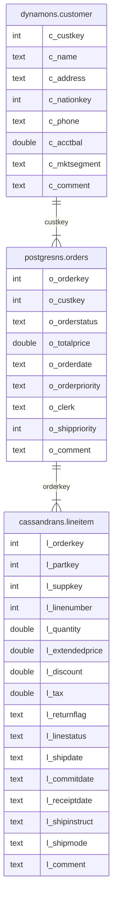

# Sample Application for ScalarDB Analytics with PostgreSQL

This tutorial describes how to create a sample application for ScalarDB Analytics with PostgreSQL.

## Prerequisites

- Docker
- psql

## Set up the database

First, you must set up the database to run analytical queries with ScalarDB Analytics with PostgreSQL. If you have not set up the database yet, please follow the instructions in [Getting Started](https://scalardb.scalar-labs.com/docs/3.9/scalardb-analytics-postgresql/getting-started.md).

## Schema in ScalarDB

In this application, you have tables with the following schema in the ScalarDB database:



`dynamons`, `postgresns`, and `cassandrans` are namespaces that are mapped to the back-end storages of DynamoDB, PostgreSQL, and Cassandra, respectively.

The `dynamons.customer` table represents information about customers. This table includes attributes like customer key, name, address, phone number, and account balance.

The `postgresns.orders` table contains information about orders that customers have placed. This table includes attributes like order key, customer key, order status, order date, and order priority.

The `cassandrans.lineitem` table represents line items associated with orders. This table includes attributes such as order key, part key, supplier key, quantity, price, and ship date.

## Schema in PostgreSQL

By running the Schema Importer, you can import the table schema in the ScalarDB database into the PostgreSQL database. More precisely, for each `namespace_name.table_name` table in the ScalarDB database, you will have a foreign table for `namespace_name._table_name` and a view for `namespace_name.table_name` in the PostgreSQL database.

The columns in the foreign table are identical to the columns in the table in PostgreSQL and in the transaction metadata. For example, in the `dynamons.customer` table in the ScalarDB database, you should see the following schema:

```shell
$ docker compose run --rm sql-cli --config /etc/scalardb.properties -e "DESCRIBE dynamons.customer";
+--------------+--------+--------------+----------------+-----------------+-----------------+-----------+
|  columnName  |  type  | isPrimaryKey | isPartitionKey | isClusteringKey | clusteringOrder | isIndexed |
+--------------+--------+--------------+----------------+-----------------+-----------------+-----------+
| c_custkey    | INT    | true         | true           | false           | null            | false     |
| c_name       | TEXT   | false        | false          | false           | null            | false     |
| c_address    | TEXT   | false        | false          | false           | null            | false     |
| c_nationkey  | INT    | false        | false          | false           | null            | false     |
| c_phone      | TEXT   | false        | false          | false           | null            | false     |
| c_acctbal    | DOUBLE | false        | false          | false           | null            | false     |
| c_mktsegment | TEXT   | false        | false          | false           | null            | false     |
| c_comment    | TEXT   | false        | false          | false           | null            | false     |
+--------------+--------+--------------+----------------+-----------------+-----------------+-----------+
```

You should see the foreign table for `dynamons._customer` in the PostgreSQL database as well.

```shell
$ psql -U postgres -h localhost test -c '\d dynamons._customer';
Password for user postgres:
                            Foreign table "dynamons._customer"
         Column         |       Type       | Collation | Nullable | Default | FDW options
------------------------+------------------+-----------+----------+---------+-------------
 c_custkey              | integer          |           |          |         |
 c_name                 | text             |           |          |         |
 c_address              | text             |           |          |         |
 c_nationkey            | integer          |           |          |         |
 c_phone                | text             |           |          |         |
 c_acctbal              | double precision |           |          |         |
 c_mktsegment           | text             |           |          |         |
 c_comment              | text             |           |          |         |
 tx_id                  | text             |           |          |         |
 tx_version             | integer          |           |          |         |
 tx_state               | integer          |           |          |         |
 tx_prepared_at         | bigint           |           |          |         |
 tx_committed_at        | bigint           |           |          |         |
 before_tx_id           | text             |           |          |         |
 before_tx_version      | integer          |           |          |         |
 before_tx_state        | integer          |           |          |         |
 before_tx_prepared_at  | bigint           |           |          |         |
 before_tx_committed_at | bigint           |           |          |         |
 before_c_name          | text             |           |          |         |
 before_c_address       | text             |           |          |         |
 before_c_nationkey     | integer          |           |          |         |
 before_c_phone         | text             |           |          |         |
 before_c_acctbal       | double precision |           |          |         |
 before_c_mktsegment    | text             |           |          |         |
 before_c_comment       | text             |           |          |         |
Server: multi_storage_dynamodb
FDW options: (namespace 'dynamons', table_name 'customer')
```

As you can see in the foreign table, the table contains the transaction metadata columns as well. These columns are required to ensure the Read Committed isolation level.

You also have the view for `dynamons.customer`, as shown below:

```shell
$ psql -U postgres -h localhost test -c '\d dynamons.customer';
Password for user postgres:
                     View "dynamons.customer"
    Column    |       Type       | Collation | Nullable | Default
--------------+------------------+-----------+----------+---------
 c_custkey    | integer          |           |          |
 c_name       | text             |           |          |
 c_address    | text             |           |          |
 c_nationkey  | integer          |           |          |
 c_phone      | text             |           |          |
 c_acctbal    | double precision |           |          |
 c_mktsegment | text             |           |          |
 c_comment    | text             |           |          |
```

The column definitions are the same as the original table in the ScalarDB database. Type mapping between ScalarDB and PostgreSQL is explained in [Data type mapping between ScalarDB and the other databases](https://scalardb.scalar-labs.com/docs/3.9/schema-loader/#data-type-mapping-between-scalardb-and-the-other-databases). Internally, this view is based on the foreign table explained above and interprets the transaction metadata to expose only the valid data with the Read Committed isolation level.

Normally, you don't need to access the foreign tables directly. You can equate the views with the tables in the ScalarDB database.

## Run analytical queries

You can run any arbitrary query that PostgreSQL supports on the above imported tables. To see which types of queries PostgreSQL supports, see the [PostgreSQL documentation](https://www.postgresql.org/docs/current/index.html).

In this example, we will run two types of queries: a single-table query and a multi-table query.

The following query reads data from `cassandrans.lineitem`, with the actual data stored in the Cassandra back-end, and calculates several summaries of the ordered line items by aggregating the data.

```shell
$ psql -U postgres -h localhost test << EOS
SELECT
        l_returnflag,
        l_linestatus,
        sum(l_quantity) AS sum_qty,
        sum(l_extendedprice) AS sum_base_price,
        sum(l_extendedprice * (1 - l_discount)) AS sum_disc_price,
        sum(l_extendedprice * (1 - l_discount) * (1 + l_tax)) AS sum_charge,
        avg(l_quantity) AS avg_qty,
        avg(l_extendedprice) AS avg_price,
        avg(l_discount) AS avg_disc,
        count(*) AS count_order
FROM
        cassandrans.lineitem
WHERE
        to_date(l_shipdate, 'YYYY-MM-DD') <= date '1998-12-01' - 3
GROUP BY
        l_returnflag,
        l_linestatus
ORDER BY
        l_returnflag,
        l_linestatus;
EOS

Password for user postgres:
 l_returnflag | l_linestatus | sum_qty |   sum_base_price   |   sum_disc_price   |     sum_charge     |       avg_qty       |     avg_price      |      avg_disc       | count_order
--------------+--------------+---------+--------------------+--------------------+--------------------+---------------------+--------------------+---------------------+-------------
 A            | F            |    1519 | 2374824.6560430005 | 1387363.5818635763 | 1962762.9341866106 | 26.6491228070175439 | 41663.590456894744 |  0.4150182982456142 |          57
 N            | F            |      98 | 146371.22954200002 |  85593.92837883368 | 121041.52567369482 | 32.6666666666666667 | 48790.409847333336 |  0.4098473333333333 |           3
 N            | O            |    5374 |  8007373.247144971 |  4685645.630765834 |  6624209.157932242 | 24.4272727272727273 |  36397.15112338623 |   0.414759749999999 |         220
 R            | F            |    1461 |  2190869.967642001 | 1284177.8484816086 | 1814150.7929095028 | 25.1896551724137931 |  37773.62013175864 | 0.41323520689655185 |          58
(4 rows)
```

You can also run a query to join tables that span multiple back-end storages.

```shell
$ psql -U postgres -h localhost test << EOS
SELECT
  l_orderkey,
  sum(l_extendedprice * (1 - l_discount)) AS revenue,
  o_orderdate,
  o_shippriority
FROM
  dynamons.customer,
  postgresns.orders,
  cassandrans.lineitem
WHERE
  c_mktsegment = 'AUTOMOBILE'
  AND c_custkey = o_custkey
  AND l_orderkey = o_orderkey
  AND o_orderdate < '1995-03-15'
  AND l_shipdate > '1995-03-15'
GROUP BY
  l_orderkey,
  o_orderdate,
  o_shippriority
ORDER BY
  revenue DESC,
  o_orderdate,
  l_orderkey
LIMIT 10
EOS

Password for user postgres:
 l_orderkey |      revenue       | o_orderdate | o_shippriority
------------+--------------------+-------------+----------------
    1071617 | 128186.94002748765 | 1995-03-10  |              0
    1959075 |  33104.49713665398 | 1994-12-23  |              0
     430243 | 19476.107574179696 | 1994-12-24  |              0
(3 rows)
```

This query joins the tables that are connected to the three back-end storages and calculates the unshipped orders with the highest revenue on a particular date.

Since ScalarDB Analytics with PostgreSQL supports all queries that PostgreSQL supports, you can use not only join, aggregation, filtering, and ordering as shown in the example, but also the window function, lateral join, or various analytical operations.
