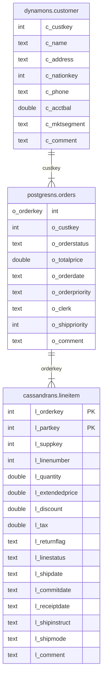

# A Sample Application of ScalarDB Analytics with PostgreSQL

This pages describe [the sample application](https://github.com/scalar-labs/scalardb-samples/scalardb-analytics-postgresql) of ScalarDB Analytics with PostgreSQL.

## Setting up the database

First, you need to set up the database to run analytical queries with ScalarDB Analytics with PostgreSQL. If you haven't done it yet, please follow the instructions in [the Getting Started page](./getting-started.md).

## Schema in ScalarDB

In this application, you have the tables with the following schema in the ScalarDB database:



The `dynamons`, `postgresns`, and `cassandrans` are namespaces mapped to the back-end storages of DynamoDB, PostgreSQL, and Cassandra respectively.

The `dynamons.customer` table represents information about customers. It includes attributes like customer key, name, address, phone number, and account balance.

The `postgresns.orders` table contains information about orders placed by customers. It includes attributes like order key, customer key, order status, order date, and order priority.

The `cassandrans.lineitem` table represents line items associated with orders. It includes attributes such as order key, part key, supplier key, quantity, price, and ship date.

## Schema in PostgreSQL

By running the Schema Importer, you can import the table schema in the ScalarDB database into the PostgreSQL database. More precisely, for each table of `namespace_name.table_name` in the ScalarDB database, you will have a foreign table of `namespace_name._table_name` and a view of `namespace_name.table_name` in the PostgreSQL database.

The foreign table has the identical columns to the table in the PostgreSQL, and the transaction metadata columns additionally. For example, given that you have the `dynamons.customer` table in the ScalarDB database with the following schema:

```shell
$ docker compose run --rm sql-cli --config /etc/scalardb.properties -e "DESCRIBE dynamons.customer";
+--------------+--------+--------------+----------------+-----------------+-----------------+-----------+
|  columnName  |  type  | isPrimaryKey | isPartitionKey | isClusteringKey | clusteringOrder | isIndexed |
+--------------+--------+--------------+----------------+-----------------+-----------------+-----------+
| c_custkey    | INT    | true         | true           | false           | null            | false     |
| c_name       | TEXT   | false        | false          | false           | null            | false     |
| c_address    | TEXT   | false        | false          | false           | null            | false     |
| c_nationkey  | INT    | false        | false          | false           | null            | false     |
| c_phone      | TEXT   | false        | false          | false           | null            | false     |
| c_acctbal    | DOUBLE | false        | false          | false           | null            | false     |
| c_mktsegment | TEXT   | false        | false          | false           | null            | false     |
| c_comment    | TEXT   | false        | false          | false           | null            | false     |
+--------------+--------+--------------+----------------+-----------------+-----------------+-----------+
```

You have the foreign table of `dynamons._customer` in the PostgreSQL database as well.

```shell
$ psql -U postgres -h localhost test -c '\d dynamons._customer';
Password for user postgres:
                            Foreign table "dynamons._customer"
         Column         |       Type       | Collation | Nullable | Default | FDW options
------------------------+------------------+-----------+----------+---------+-------------
 c_custkey              | integer          |           |          |         |
 c_name                 | text             |           |          |         |
 c_address              | text             |           |          |         |
 c_nationkey            | integer          |           |          |         |
 c_phone                | text             |           |          |         |
 c_acctbal              | double precision |           |          |         |
 c_mktsegment           | text             |           |          |         |
 c_comment              | text             |           |          |         |
 tx_id                  | text             |           |          |         |
 tx_version             | integer          |           |          |         |
 tx_state               | integer          |           |          |         |
 tx_prepared_at         | bigint           |           |          |         |
 tx_committed_at        | bigint           |           |          |         |
 before_tx_id           | text             |           |          |         |
 before_tx_version      | integer          |           |          |         |
 before_tx_state        | integer          |           |          |         |
 before_tx_prepared_at  | bigint           |           |          |         |
 before_tx_committed_at | bigint           |           |          |         |
 before_c_name          | text             |           |          |         |
 before_c_address       | text             |           |          |         |
 before_c_nationkey     | integer          |           |          |         |
 before_c_phone         | text             |           |          |         |
 before_c_acctbal       | double precision |           |          |         |
 before_c_mktsegment    | text             |           |          |         |
 before_c_comment       | text             |           |          |         |
Server: multi_storage_dynamodb
FDW options: (namespace 'dynamons', table_name 'customer')
```

As you can see, the tables contains the transaction metadata columns as well. This is required to ensure the Read-Committed isolation level.

You also have the view of `dynamons.customer` as below:

```shell
$ psql -U postgres -h localhost test -c '\d dynamons.customer';
Password for user postgres:
                     View "dynamons.customer"
    Column    |       Type       | Collation | Nullable | Default
--------------+------------------+-----------+----------+---------
 c_custkey    | integer          |           |          |
 c_name       | text             |           |          |
 c_address    | text             |           |          |
 c_nationkey  | integer          |           |          |
 c_phone      | text             |           |          |
 c_acctbal    | double precision |           |          |
 c_mktsegment | text             |           |          |
 c_comment    | text             |           |          |
```

The column definitions are completely the same as the original table in the ScalarDB database. Type mapping between ScalarDB and PostgreSQL is explained [here](https://scalardb.scalar-labs.com/docs/3.9/schema-loader/#data-type-mapping-between-scalardb-and-the-other-databases). Internally, this view is based on the foreign table explained above, and it interprets the transaction metadata to expose only the valid data with Read-Committed isolation level.

Normally, you don't need to access the foreign tables directly. You can equate the views with the tables in the ScalarDB database.

## Running analytical queries

You can run any arbitrary queries with the above imported tables supported by PostgreSQL. PostgreSQL support various type of queries. Please refer to [the PostgreSQL official documentation](https://www.postgresql.org/docs/current/index.html).

In this example, we will two types of queries: a single-table query and a multi-table query.

The following query read data from `cassandrans.lineitem`, whose actual data is stored in the back-end Cassandra, and calculate several summaries of the ordered line items by aggregating the data.

```shell
$ psql -U postgres -h localhost test << EOS
SELECT
        l_returnflag,
        l_linestatus,
        sum(l_quantity) AS sum_qty,
        sum(l_extendedprice) AS sum_base_price,
        sum(l_extendedprice * (1 - l_discount)) AS sum_disc_price,
        sum(l_extendedprice * (1 - l_discount) * (1 + l_tax)) AS sum_charge,
        avg(l_quantity) AS avg_qty,
        avg(l_extendedprice) AS avg_price,
        avg(l_discount) AS avg_disc,
        count(*) AS count_order
FROM
        cassandrans.lineitem
WHERE
        to_date(l_shipdate, 'YYYY-MM-DD') <= date '1998-12-01' - 3
GROUP BY
        l_returnflag,
        l_linestatus
ORDER BY
        l_returnflag,
        l_linestatus;
EOS

Password for user postgres:
 l_returnflag | l_linestatus | sum_qty |   sum_base_price   |   sum_disc_price   |     sum_charge     |       avg_qty       |     avg_price      |      avg_disc       | count_order
--------------+--------------+---------+--------------------+--------------------+--------------------+---------------------+--------------------+---------------------+-------------
 A            | F            |    1519 | 2374824.6560430005 | 1387363.5818635763 | 1962762.9341866106 | 26.6491228070175439 | 41663.590456894744 |  0.4150182982456142 |          57
 N            | F            |      98 | 146371.22954200002 |  85593.92837883368 | 121041.52567369482 | 32.6666666666666667 | 48790.409847333336 |  0.4098473333333333 |           3
 N            | O            |    5374 |  8007373.247144971 |  4685645.630765834 |  6624209.157932242 | 24.4272727272727273 |  36397.15112338623 |   0.414759749999999 |         220
 R            | F            |    1461 |  2190869.967642001 | 1284177.8484816086 | 1814150.7929095028 | 25.1896551724137931 |  37773.62013175864 | 0.41323520689655185 |          58
(4 rows)
```

You can also join the tables spanning the multiple back-end storages.

```shell
$ psql -U postgres -h localhost test << EOS
SELECT
  l_orderkey,
  sum(l_extendedprice * (1 - l_discount)) AS revenue,
  o_orderdate,
  o_shippriority
FROM
  dynamons.customer,
  postgresns.orders,
  cassandrans.lineitem
WHERE
  c_mktsegment = 'AUTOMOBILE'
  AND c_custkey = o_custkey
  AND l_orderkey = o_orderkey
  AND o_orderdate < '1995-03-15'
  AND l_shipdate > '1995-03-15'
GROUP BY
  l_orderkey,
  o_orderdate,
  o_shippriority
ORDER BY
  revenue DESC,
  o_orderdate,
  l_orderkey
LIMIT 10
EOS

Password for user postgres:
 l_orderkey |      revenue       | o_orderdate | o_shippriority
------------+--------------------+-------------+----------------
    1071617 | 128186.94002748765 | 1995-03-10  |              0
    1959075 |  33104.49713665398 | 1994-12-23  |              0
     430243 | 19476.107574179696 | 1994-12-24  |              0
(3 rows)
```

This query joins the tables connected to the three back-end storages and calculates the unshipped orders with the highest revenue on a particular date.

As ScalarDB Analytics with PostgreSQL supports all queries supported by PostgreSQL, you can use not only join, aggregation, filtering, and ordering as shown in the example, but also window function, lateral join, or various analytical operations. Let's try to run any queries you want.
